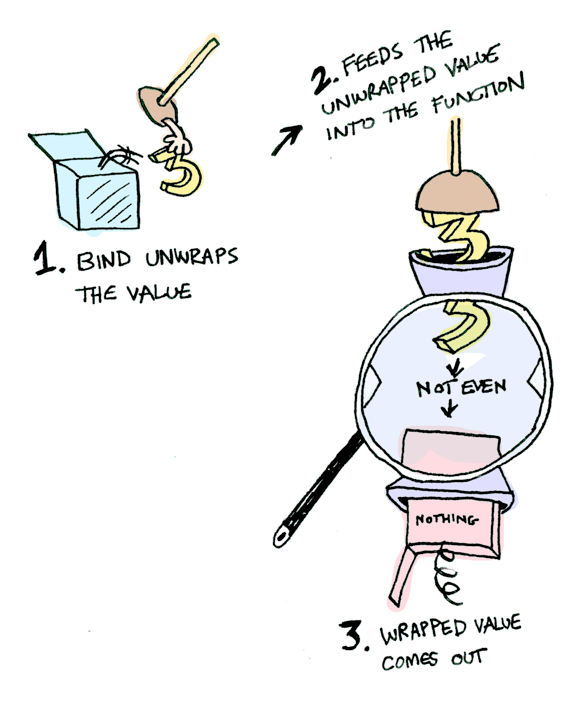

# Introduction

## Getting Started

In this module we will see more fundamental type classes of PureScript and Haskell.

To run this presentation type (you will need [nix](https://nixos.org)):

```sh
../../slide README.md
```

### Community Support

- [LovelaceAcademy Discord](https://discord.gg/fWP9eGdfZ8)
- [StackExchange](https://cardano.stackexchange.com/) (:bulb: use the tag lovelace-academy)
- [Plutonomicon Discord](https://discord.gg/gGFdGaUE)

[](https://www.youtube.com/watch?v=aMijBRylVjg&list=PLHJ1yaDcSSacSplmEvbaSaHMHKnCUeG4O)

## What you should know

1. PureScript (modules 2-4)

# Apply and Applicatives

## Recap Functor


## Recap Functor Type Class

Functor is a type class which enables map operations over some type

```haskell
class Functor :: (Type -> Type) -> Constraint
class Functor f where
  map :: forall a b. (a -> b) -> f a -> f b

infixl 4 map <$>
```

So we can:

```haskell
(+) 3 <$> Just 2
-- Just 5
```

## Functor problem

What happens when you map a function that receives more than one argument?

```haskell
-- + :: Int -> Int -> Int
x = (+) <$> Just 3
-- ok: x = Just ((+) 3) :: Maybe (Int -> Int)
y = x ?? Just 2
-- ?? can't be <$> :: (a -> b) -> f a -> f b
-- what ?? would be to have: y = Just 5 :: Maybe Int
```

## Applicative Just


## Apply Type Class

```haskell
class Apply :: (Type -> Type) -> Constraint
class (Functor f) <= Apply f where
  apply :: forall a b. f (a -> b) -> f a -> f b

infixl 4 apply <*>
```

So we can:

```haskell
x = (+) <$> Just 2
-- x = Just ((+) 3) :: Maybe (Int -> Int)

y =  x <*> Just 3
-- y = Just 5 :: Maybe Int
```

Or even:

```haskell
(+) <$> Just 2 <*> Just 3
-- Just 5 :: Maybe Int
```

You can have any number of arguments:

```haskell
foo = functionTakingNArguments <$> computationProducingArg1
                               <*> computationProducingArg2
                               <*> ...
                               <*> computationProducingArgN
```

> :bulb: nothing says that computations must happen sequentially, actually `Apply` allows parallel computation and we'll see it in the future

## Apply problem

What if you don't know the box type, eg:

```haskell
x :: forall f. Apply f => f Int
x = (+) <$> ?? 2 <*> ?? 3
-- ?? would be :: Int -> f Int
```

## Applicative Type Class

```haskell
class Applicative :: (Type -> Type) -> Constraint
class (Apply f) <= Applicative f where
  pure :: forall a. a -> f a
```

So we can:


```haskell
x :: forall f. Applicative f => f Int
x = (+) <$> pure 2 <*> pure 3

y :: Maybe Int
y = x
-- like magic: y = Just 5
```

## Applicative problem

```haskell
data Maybe a = Nothing | Just a

half x = case even x of
    true -> Just (x `div` 2)
    false -> Nothing
```

## Half


## Half Ouch


## Plunger


## Bind Type Class

```haskell
data Maybe a = Nothing | Just a

half :: Int -> Maybe Int
half x = case even x of
    true -> Just (x `div` 2)
    false -> Nothing
```

```haskell
> Just 3 >>= half
Nothing
> Just 4 >>= half
Just 2
> Nothing >>= half
Nothing
-- (>>=) :: f a -> (a -> f b) -> f b
```

```haskell
class Bind :: (Type -> Type) -> Constraint
class (Apply m) <= Bind m where
    bind :: forall a b. m a -> (a -> m b) -> m b

infixl 1 bind as >>=

instance Bind Maybe where
    bind (Just x) fn = fn x
    bind Nothing  _ = Nothing
```

## Bind Just



## Bind Nothing


## Bind Chain

```haskell
> Just 20 >>= half >>= half >>= half
Nothing
```

## Bind Chain 2


## Monad

Put simply Monad is Bind (`>>=`) + Applicative (`pure`):

```haskell
class (Applicative m, Bind m) <= Monad m
```

So, as in Applicative, we can:

```haskell
xs :: forall m. Monad m => m Int
xs = pure 20 >>= half

ys :: Maybe Int
ys = xs

ys :: Tuple String Int
ys = xs
-- Tuple bind works on the snd value
```

## Do notation

The do notation is a syntax suggar for `>>=`:

```purescript
module Main where

import Prelude (($), (>>=), (==), div, bind, show)
import Data.Maybe (Maybe(Nothing, Just))
import Data.Int (even)
import Effect.Console (log)

half x = case even x of
  true -> Just (x `div` 2)
  false -> Nothing

x = do
  v <- Just 20
  v' <- half v
  half v'
  
-- translates to
y = Just 20 >>= \v -> half v >>= \v' -> half v'

-- which is the same of
z = Just 20 >>= half >>= half

main = log $ show [x, y, z]
```

## Effect (Haskell IO)

The `Effect` is a type without constructors that represent effects in the runtime.

```haskell
data Effect a
```

The underlying `a`is the return type, it can be `Unit` to represent a non-returning `Effect`

```purescript'
module Main where

import Prelude (Unit, unit, pure)
import Effect (Effect)
import Effect.Console (log)

main :: Effect Unit
main = log "hello"
-- the side-effect in this case is logging in the console
```

```purescript
module Main where

import Prelude (Unit, ($), (>>=), (<>), show)
import Effect (Effect)
import Effect.Console (log)
import Effect.Now (nowDate)

main :: Effect Unit
main = nowDate >>= \d -> log $ "the current date is " <> show d
```

## Combining Effects

```purescript
module Main where

import Prelude (Unit, ($), (>>=), (<>), (>>>), (<$>), (<*>), bind, pure, discard, show)
import Effect (Effect)
import Effect.Console (log)
import Effect.Now (nowDate, nowTime)
import Effect.Random (random)

showNowDate :: Effect String
showNowDate = do
    d <- nowDate
    pure $ "the current date is: " <> show d 

showNowTime :: Effect String
showNowTime = (\d -> "the current date is: " <> show d) <$> nowTime

logRandom :: Effect Unit
logRandom = show >>> (<>) "here is a random number: " <$> random >>= log

main :: Effect Unit
main = do
  showNowDate >>= log
  showNowTime >>= log
  logRandom
```

## Credits

Pictures and examples from [adit.io](https://adit.io/posts/2013-04-17-functors,_applicatives,_and_monads_in_pictures.html)

# Breakthrough

## Exercise 

In module 04 we've used `buildTx` to simulate a transaction build, in this module we'll simulate a Contract behavior using what we've learned so far.

```purescript
type Validator = Redeemer -> ScriptContext -> Datum -> Boolean

data Contract a = Contract a

buildTx :: Inputs -> Outputs -> Redeemer -> Validator -> Contract Boolean

runContract :: forall a. Contract a -> Effect a
```

Change previous created `buildTx` to return the value using the `Contract` monad and implement the missing definitions. `runContract` must log in the console the contract execution. 
