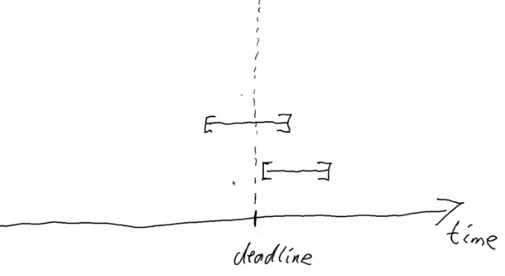

# Introduction

## Getting Started

In this module we'll see how to handle time in the blockchain and build a Vesting Contract.

To run this presentation type (you will need [nix](https://nixos.org)):

```sh
../../slide README.md
```

### Community Support

- [LovelaceAcademy Discord](https://discord.gg/fWP9eGdfZ8)
- [StackExchange](https://cardano.stackexchange.com/) (:bulb: use the tag lovelace-academy)
- [Plutonomicon Discord](https://discord.gg/gGFdGaUE)

[Module video] - Coming Soon...

## What you should know

- Bulding smart contracts (module 6);
- Cardano-Transaction-Lib (module 8);
- Halogen (modules 7 and 8);
- Although not required, [variants](https://github.com/natefaubion/purescript-variant) will be useful for [halogen-formless](https://github.com/thomashoneyman/purescript-halogen-formless).

# Script Context

## Script Context and Purpose

```haskell
data ScriptContext = ScriptContext
    { scriptContextTxInfo :: TxInfo
      scriptContextPurpose :: ScriptPurpose
    }

data ScriptPurpose =
      Minting CurrencySymbol
    | Spending TxOutRef
    | Rewarding StakingCredential
    | Certifying DCert

data TxOutRef = TxOutRef
    { txOutRefId :: TxId
    , txOutRefIdx :: Integer
    }

data TxId = TxId { getTxId :: BuiltinByteString }
```

## Transaction Info

```haskell
data TxInfo = TxInfo
    { txInfoInputs :: [TxInInfo]
    , txInfoReferenceInputs :: [TxInInfo]
    , txInfoOutputs :: [TxOut]
    , txInfoFee :: Value
    , txInfoMint :: Value
    , txInfoDCert :: [DCert]
    , txInfoWdrl :: Map StakingCredential Integer   
    , txInfoValidRange :: POSIXTimeRange
    , txInfoSignatories :: [PubKeyHash]
    , txInfoRedeemers :: Map ScriptPurpose Redeemer
    , txInfoData :: Map DatumHash Datum
    , txInfoId :: TxId
    }
```

# Handling Time

## Assumptions

- `1 slot = 1 second up to 36 hours` (by protocol design)
- Allowed time range can be provided on transaction creation in POSIX format

## POSIXTimeRange

```haskell
type POSIXTimeRange = Interval POSIXTime

newtype POSIXTime = POSIXTime { getPOSIXTime :: Integer }

data Interval a = Interval
    { ivFrom :: LowerBound a
    , ivTo :: UpperBound a
    }

data LowerBound a = LowerBound (Extended a) Closure	
data UpperBound a = UpperBound (Extended a) Closure	

type Closure = Bool

data Extended a = NegInf | Finite a	| PosInf
```

## Deadline



## Vesting Contract

- [Vesting Contract](https://plutus-pioneer-program.readthedocs.io/en/latest/pioneer/week3.html#example-vesting)
- [PPP 030304](https://www.youtube.com/watch?v=ae7U_yKIQ0Y)

# Breakthrough: Building the UI for the Vesting Contract

## Description

> As a donator I want to lock an ADA value in a contract, to be rewarded to a given beneficiary according a given deadline

> As the beneficiary I want to reclaim the locked ADA value only after the deadline

## Bootstrap

```
mkdir modules/M10-a-vesting-contract/{contract,dapp}

(
  cd modules/M10-a-vesting-contract/contract
  nix flake init -t github:LovelaceAcademy/nix-templates#hor-plutus
)

(
  cd modules/M10-a-vesting-contract/dapp
  nix flake init -t github:LovelaceAcademy/nix-templates#pix-ctl-full
)
```
